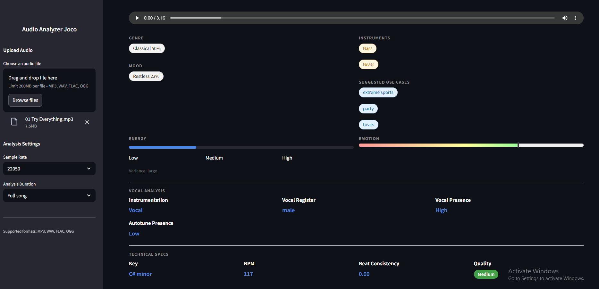

# Music Analysis Application

This application allows users to upload audio files and receive detailed analysis of the audio, including:
- Genre detection
- Mood analysis
- Instrument identification
- Energy level measurement
- Emotional content analysis
- Vocal analysis
- Technical specifications (key, BPM, beat consistency)
- Audio quality assessment

## Features

- Upload interface for music files (MP3, WAV, FLAC, OGG)
- Comprehensive audio analysis
- Visual representation of analysis results
- Audio waveform and spectrogram visualization
- Suggested use cases for the audio
- Downloadable analysis results

## Requirements

- Python 3.11 or higher
- All dependencies are listed in `requirements.txt`

## Setup and Installation

1. Clone this repository:
```bash
git clone <repository-url>
cd MusicVision
```

2. Create a virtual environment (recommended):
```bash
# On Windows
python -m venv venv
.\venv\Scripts\activate

# On macOS/Linux
python -m venv venv
source venv/bin/activate
```

3. Install the required dependencies:
```bash
pip install -r requirements.txt
```

## Running the Application

1. Make sure your virtual environment is activated (if you're using one)

2. Start the Streamlit application:
```bash
streamlit run app.py
```

3. The application will open in your default web browser. If it doesn't open automatically, you can access it at:
   - http://localhost:8501

## Usage

1. Once the application is running, you'll see the upload interface
2. Click on "Browse files" or drag and drop your audio file
3. Wait for the analysis to complete
4. View the detailed analysis results and visualizations
5. Download the analysis results if needed

## Supported File Formats

- MP3 (.mp3)
- WAV (.wav)
- FLAC (.flac)
- OGG (.ogg)

## Troubleshooting

If you encounter any issues:
1. Ensure you have Python 3.11 or higher installed
2. Verify all dependencies are installed correctly
3. Check that your audio file is in a supported format
4. Make sure you have sufficient system resources for audio processing
